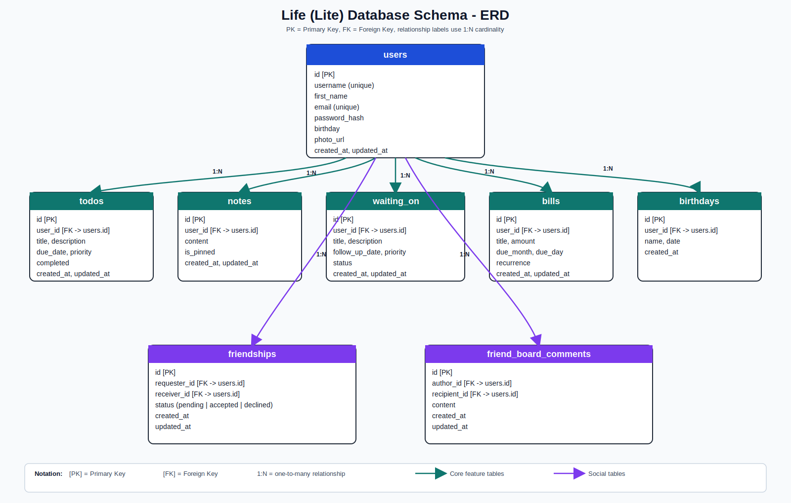
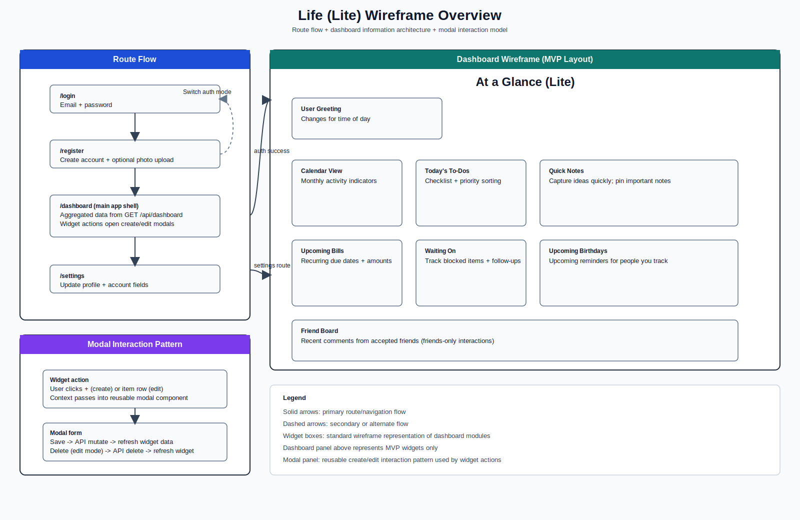
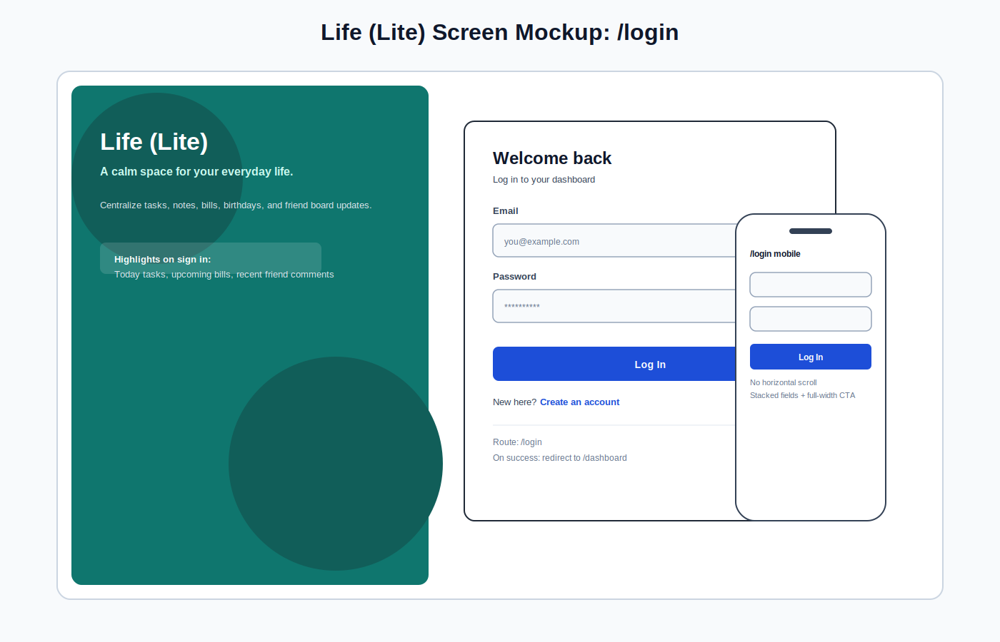
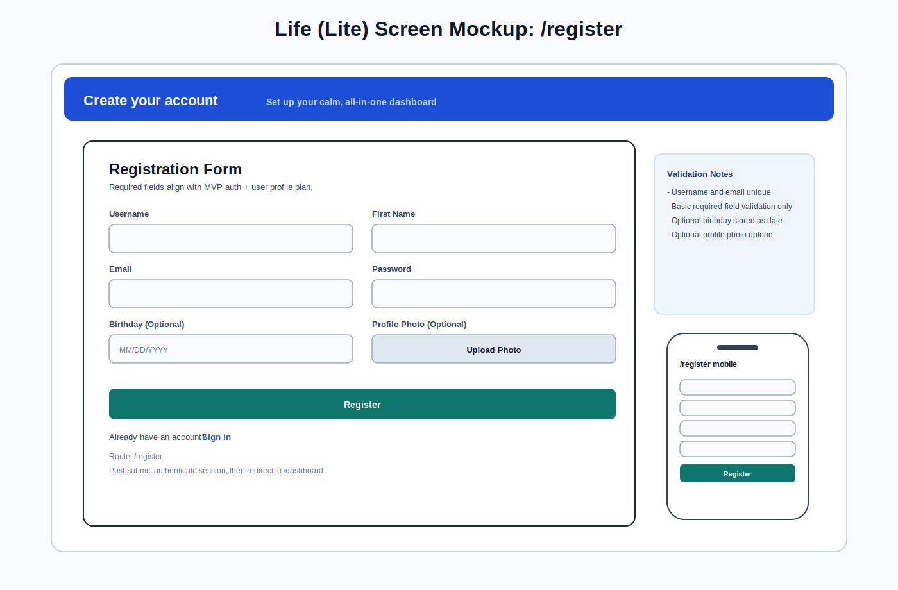
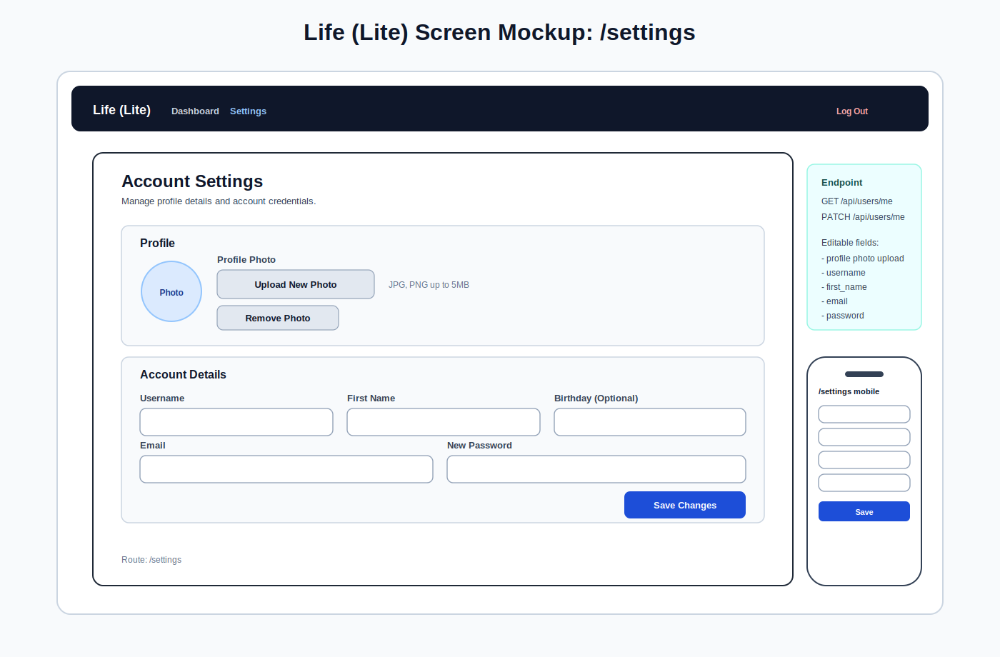

## Project Elevator Pitch

Life (Lite) is a personal dashboard built to reduce the anxiety that comes from managing your life across too many apps. It centralizes tasks, notes, deadlines, and reminders into one calm, visually intuitive space, so nothing important gets lost. The app is designed to prioritize clarity and ease—separating ideas from responsibilities, highlighting what matters most, and even tracking things that are out of your control with a “waiting on” system. It also includes a private friend board for simple, meaningful connection without the noise of social media.

## Scope Adjustment (April 13, 2026)
The original MVP scope included both **Waiting On** and **Friend/Social** modules. After comparing implementation pace to the April 22 capstone deadline, scope was adjusted to keep the timeline realistic and preserve quality on core deliverables.

- Deferred to stretch/post-deadline:
  - Waiting On (`#25-#28`)
  - Friend/Social (`#35-#37`)
- Rationale:
  - Estimated remaining effort exceeded realistic delivery pace before April 22
  - Keeping these in MVP increased risk to testing depth and stability
- Product intent remains unchanged:
  - These features were planned, are still documented, and are deferred rather than removed

## Concrete Core Features (MVP)
### Summary
The MVP for Life (Lite) focuses on a scoped set of features that centralize personal organization into a single, calm dashboard experience. The application emphasizes clarity, low cognitive load, and practical day-to-day usefulness while demonstrating full-stack functionality.

### Core Features
### Dashboard (Centralized Home)
* Main page after login
* Fixed layout with scrollable widgets
* Displays:
* calendar
* to-dos
* notes
* bills / subscriptions
* birthdays
* Each widget includes a subtle item count
* Add/edit actions handled via modal forms
* Data loaded through a single aggregated API endpoint

### Calendar
* Month-view calendar grid (non-clickable in MVP)
* Implemented using an open-source React calendar library to reduce development complexity
* Displays up to 3 color-coded dot indicators per day
* Ellipsis shown when more than 3 items exist
* Used for visual awareness only (not full scheduling)

### To-Do Management
* Create, edit, complete, and delete tasks
* Fields:
  * title
  * description
  * due date (optional)
  * priority (low, medium, high)
* Filters:
  * Today (default)
  * Week
  * All
* Tasks without due dates appear only in All
* Sorted by priority → due date
* Completed tasks removed from active view

### Notes Widget
* Plain-text note capture
* Create, edit, pin, and delete notes
* Displays last updated timestamp
* Pinned notes appear first
* Designed for quick idea capture and mental offloading

### Waiting On Tracker
* Tracks items dependent on external action
* Fields:
  * title
  * description
  * follow-up date (optional)
  * priority
  * status (pending, followed up, resolved)
* Sorted by follow-up date
* Resolved items removed from active view

### Bills / Subscriptions
* Tracks recurring financial obligations
* Fields:
  * title
  * amount
  * next due date
  * recurrence type
  * paid status
  * last paid timestamp
  * active/inactive status
* Designed to surface upcoming bills from a concrete next due date, then advance that date automatically based on recurrence
* Displays only the next upcoming occurrence
* Supports create, edit, and delete
* Includes lightweight payment tracking so the app can mark a bill paid and calculate the next due date without storing full payment history in MVP

### Birthdays
* Displays upcoming birthdays within the dashboard
* Supports lightweight awareness and personalized greeting use cases

### Friend System & Friend Board
* Send friend requests via username or email
* Mutual friendship required for interaction
* Private message board per user
* Create, edit, and delete comments
* Dashboard displays the 5 most recent comments

### Profile / Settings
* Manage:
* photo
* username
* first name
* email
* password
* birthday
* Supports account management and personalization

### Moved to Stretch Goals
* Deadlines
* Poke feature
* Weather widget
* Quote of the day
* Weekly goals
* Rearrangeable dashboard widgets
* Clickable calendar interactions
* Waiting On module (`#25-#28`)
* Friend/Social module (`#35-#37`)

## Stretch Goal Features
### Summary
The following features are planned as stretch goals to enhance the user experience and extend the functionality of the application beyond the core MVP. These features will only be implemented if time allows after completing all core functionality.

### Deferred From Original MVP
#### Waiting On Tracker
* Tracks items dependent on external action
* Includes status workflow and follow-up date handling
* Deferred after April 13 timeline rebaseline

#### Friend System & Friend Board
* Friend request flow and friend board comments
* Private interaction model between accepted friends
* Deferred after April 13 timeline rebaseline

### Product Enhancements
#### Deadlines
* Add a dedicated deadlines system for one-time, high-importance dates
* Includes priority and overdue tracking
* Further separates urgent commitments from general tasks

#### Authentication Hardening
* Add password strength checks (length/complexity rules) after MVP

#### Weekly Goals
* Allows users to define short-term goals for the current week
* Provides a lightweight layer between tasks and longer-term planning

### Contextual Enhancements
#### Weather Widget
* Displays current weather conditions
* Uses an external API
* Adds environmental context to the dashboard

#### Quote of the Day
* Displays a rotating or randomized quote
* Can be seeded or fetched from an API
* Adds light personality without increasing complexity

### Social Enhancement
#### Poke Feature
* Lightweight, one-click interaction between friends
* Timestamped with no message body
* Adds a playful, low-pressure connection layer

### Future Enhancements (Post-MVP Direction)
These features are intentionally out of scope for the capstone timeline but represent natural future evolution of the product.
#### Rearrangeable Dashboard Widgets
* Allow users to customize layout via drag-and-drop
#### Clickable Calendar Interactions
* Enable date selection to view detailed daily activity

## Project Management System
Project management goals:
* structured
* realistic
* not overcomplicated

### Summary
The project will be managed using a ticket-based workflow, with development broken down into clear, high-level tasks across frontend, backend, and integration layers. Work will be tracked using a Kanban-style board (e.g., GitHub Projects), with tickets organized by feature and development phase.

### High-Level Tickets
Tickets are grouped by project phase.

#### Phase 1 — Project Setup & Foundations
* Initialize repository and project structure
* Set up backend server (Node + Express)
* Set up PostgreSQL database
* Configure environment variables
* Set up frontend (React + routing)
* Establish basic styling system (theme, layout foundation)

#### Phase 2 — Authentication & User System
* Implement user registration
* Implement user login
* Password hashing and validation
* Authentication middleware (protected routes)
* Build profile/settings page
* Connect user data to database

#### Phase 3 — Core Data Models & API
* Design and implement database schema:
  * todos
  * notes
  * waiting_on
  * bills
  * friendships
  * friend_board_comments
* Build CRUD API endpoints for each model
* Implement relationships (users ↔ friends, users ↔ data)

#### Phase 4 — Dashboard Aggregation
* Create /api/dashboard endpoint
* Aggregate data from all core tables
* Optimize response structure for frontend consumption

#### Phase 5 — Core Features (Frontend + Backend Integration)
* To-Do Management UI + API integration
* Notes Widget UI + API integration
* Waiting On Tracker UI + API integration
* Bills / Subscriptions UI + API integration
* Friend system (requests + acceptance)
* Friend board (create + display comments)

#### Phase 6 — Calendar & Birthdays
* Integrate open-source calendar component
* Map data to calendar indicators (events, tasks, etc.)
* Implement birthday display logic

#### Phase 7 — Dashboard UI Assembly
* Build dashboard layout
* Implement scrollable widgets
* Add modal interactions (create/edit forms)
* Add filtering (To-Dos: Today / Week / All)
* Add sorting logic (priority → date)

#### Phase 8 — Polish & Finalization
* UI refinement (spacing, colors, consistency)
* Error handling and edge cases
* Basic validation (forms, inputs)
* Performance cleanup
* Final testing

### Ticket Assignment Strategy
Since this is a solo project:
* All tickets will be assigned to a single developer (self)
* Work will be completed sequentially by phase
* Each ticket will represent a small, testable unit of work
Tickets will move through the following stages:
* Backlog
* In Progress
* Review / Testing
* Complete

### Development Approach
* Backend and database models will be built first
* Core API endpoints will be tested independently
* Frontend components will then integrate with the API
* Features will be developed incrementally and tested continuously
* Priority will be given to completing MVP features before attempting stretch goals

## Database Schema
### Overview
The application will use a relational database (PostgreSQL) to store user data and all associated entities. Each primary feature is represented by its own table, with relationships defined through foreign keys.
All user-generated data is scoped to the authenticated user via user_id.

### Core Tables
#### Users
Stores account and profile information.
users
- id (PK)
- username (unique)
- first_name
- email (unique)
- password_hash
- birthday
- photo_url
- created_at
- updated_at

#### Todos
todos
- id (PK)
- user_id (FK → users.id)
- title
- description
- due_date (nullable)
- priority (low | medium | high)
- completed (boolean)
- created_at
- updated_at

#### Notes
notes
- id (PK)
- user_id (FK → users.id)
- content
- is_pinned (boolean)
- created_at
- updated_at

#### Waiting On
waiting_on
- id (PK)
- user_id (FK → users.id)
- title
- description
- follow_up_date (nullable)
- priority (low | medium | high)
- status (pending | followed_up | resolved)
- created_at
- updated_at

#### Bills / Subscriptions
bills
- id (PK)
- user_id (FK → users.id)
- title
- amount
- next_due_date
- recurrence (once | weekly | monthly | annually)
- paid
- last_paid_at
- is_active
- created_at
- updated_at

Note: The original MVP plan stored bills using month + day only. During implementation, the bills model was intentionally expanded to use `next_due_date` plus recurrence and payment state. This keeps the dashboard simple while allowing the backend to automate date advancement after a bill is paid. `paid`, `last_paid_at`, and `is_active` are included so the app can distinguish unpaid upcoming bills, recently paid bills, and paused/cancelled subscriptions without exposing sensitive payment details or requiring a separate payment history table for MVP.

#### Birthdays
birthdays
- id (PK)
- user_id (FK → users.id)
- name
- date
- created_at

Note: Birthdays can optionally be derived from user profiles, but this table allows tracking additional people.

### Social Tables
#### Friendships
friendships
- id (PK)
- requester_id (FK → users.id)
- receiver_id (FK → users.id)
- status (pending | accepted | declined)
- created_at
- updated_at

#### Friend Board Comments
friend_board_comments
- id (PK)
- author_id (FK → users.id)
- recipient_id (FK → users.id)
- content
- created_at
- updated_at

### Relationships Overview
* A user has many:
* todos
* notes
* waiting_on items
* bills
* birthdays
* Friendships:
* self-referencing relationship between users
* Friend board comments:
* connect two users (author ↔ recipient)

## API Endpoints
### Overview
The backend will expose REST-style API endpoints for authentication, dashboard aggregation, and CRUD operations across each MVP feature. Most user-specific data will be scoped to the authenticated user.

### Authentication
#### Auth
POST /api/auth/register
POST /api/auth/login
POST /api/auth/logout
GET  /api/auth/me

**Purpose**
* Register a new user
* Authenticate an existing user
* End a session / logout
* Retrieve the currently authenticated user
**Tables Used**
* users

### Dashboard
#### Dashboard
GET /api/dashboard

**Purpose**
Returns aggregated data needed to render the main dashboard for the logged-in user.
**Likely Response Includes**
* calendar data
* todos
* notes
* waiting_on
* bills
* birthdays
* recent friend board comments
**Tables Used**
* todos
* notes
* waiting_on
* bills
* birthdays
* friend_board_comments
* users

### Todos
#### Todo Endpoints
GET    /api/todos
POST   /api/todos
PATCH  /api/todos/:id
DELETE /api/todos/:id

**Purpose**
Supports creating, retrieving, updating, and deleting to-do items.
**Tables Used**
* todos
**Notes**
* GET /api/todos may support filtering by:
  * today
  * week
  * all

### Notes
#### Note Endpoints
GET    /api/notes
POST   /api/notes
PATCH  /api/notes/:id
DELETE /api/notes/:id

**Purpose**
Supports note creation, editing, pinning, listing, and deletion.
**Tables Used**
* notes

### Waiting On
#### Waiting On Endpoints
GET    /api/waiting-on
POST   /api/waiting-on
PATCH  /api/waiting-on/:id
DELETE /api/waiting-on/:id

**Purpose**
Supports managing externally dependent items, including status updates and follow-up tracking.
**Tables Used**
* waiting_on

### Bills / Subscriptions
#### Bill Endpoints
GET    /api/bills
POST   /api/bills
PATCH  /api/bills/:id
DELETE /api/bills/:id

**Purpose**
Supports creating, editing, listing, deleting, and marking recurring financial obligations as paid. Bill records store the next concrete due date and recurrence settings so the server can automate future due dates after payment.
**Tables Used**
* bills

### Birthdays
#### Birthday Endpoints
GET    /api/birthdays
POST   /api/birthdays
PATCH  /api/birthdays/:id
DELETE /api/birthdays/:id

**Purpose**
Supports managing birthday records shown on the dashboard.
**Tables Used**
* birthdays

### Friends / Social
#### Friendship Endpoints
GET    /api/friends
POST   /api/friends/request
PATCH  /api/friends/:id

**Purpose**
Supports viewing friendships and responding to pending friend requests.
**Notes**
PATCH /api/friends/:id is used to accept or decline a request via request body status.
Example body:
`{ "status": "accepted" }` or `{ "status": "declined" }`
**Tables Used**
* friendships

#### Friend Board Endpoints
GET    /api/friend-board
POST   /api/friend-board
PATCH  /api/friend-board/:id
DELETE /api/friend-board/:id

**Purpose**
Supports viewing recent board comments and creating, editing, or deleting comments.
**Tables Used**
* friend_board_comments
* friendships
**Notes**
* Access is limited to accepted friends only
* Users may only edit/delete their own comments

### Profile / Settings
#### User Settings Endpoints
GET   /api/users/me
PATCH /api/users/me

**Purpose**
Allows the logged-in user to retrieve and update their own profile/settings information.
**Editable Fields**
* photo
* username
* first name
* email
* password
* birthday
**Tables Used**
* users

### Endpoint Design Notes
* All protected routes require authentication
* Most feature routes operate only on records owned by the logged-in user
* Social routes require additional authorization logic to confirm friendship status
* The dashboard endpoint is intentionally aggregated to simplify the frontend home-page load

## Detailed Wireframe
### Overview
The frontend will be structured around a small set of core pages, with the dashboard acting as the main application view after login. The UI is designed to feel calm, visually intuitive, and easy to scan, with a fixed layout and modal-based interactions for creating and editing data.

### Screen Mockups (Auth + Settings)
The following SVG mockups provide a more detailed visual direction for the core account-related screens:

### Core Routes / Pages
1. Landing / Login Page
Route: /login
**Purpose**
* Allows existing users to sign in
**Elements**
* Email input
* Password input
* Login button
* Link to Register page

2. Register Page
Route: /register
**Purpose**
* Allows new users to create an account
**Elements**
* Username input
* First name input
* Email input
* Password input
* Optional birthday input
* Optional profile photo upload
* Register button
* Link to Login page

3. Dashboard Page
Route: /dashboard
**Purpose**
* Main home page after login
* Centralized view of all core app features
**Main Layout**
Fixed dashboard layout with multiple scrollable widgets.
**Planned Widgets**
* Greeting header
* Calendar
* To-Dos
* Notes
* Waiting On
* Bills / Subscriptions
* Birthdays
* Friend Board preview
**Widget Behavior**
* Each widget includes a subtle count indicator
* Add/edit actions open modal forms
* Data is pulled from the aggregated dashboard endpoint
* Scrollable content within widgets where needed

4. Profile / Settings Page
Route: /settings
**Purpose**
* Allows user to manage account/profile data
**Elements**
* Profile photo
* Username
* First name
* Email
* Password update
* Birthday
* Save changes button

### Modal Forms
Instead of separate create/edit pages, most interactions will happen through small modal forms layered on top of the dashboard.

#### To-Do Modal
**Used For**
* create to-do
* edit to-do
**Fields**
* Title
* Description
* Due date
* Priority
* Save button
* Delete button (edit mode only)

#### Note Modal
**Used For**
* create note
* edit note
**Fields**
* Note content
* Pin toggle
* Save button
* Delete button (edit mode only)

#### Waiting On Modal
**Used For**
* create item
* edit item
**Fields**
* Title
* Description
* Follow-up date
* Priority
* Status
* Save button
* Delete button (edit mode only)

#### Bill / Subscription Modal
**Used For**
* create bill
* edit bill
**Fields**
* Title
* Amount
* Due month
* Due day
* Recurrence
* Save button
* Delete button (edit mode only)

#### Birthday Modal
**Used For**
* create birthday
* edit birthday
**Fields**
* Name
* Date
* Save button
* Delete button (edit mode only)

#### Friend Request Modal
**Used For**
* send friend request
**Fields**
* Username or email
* Send request button

#### Friend Board Comment Modal
**Used For**
* create comment
* edit comment
**Fields**
* Comment content
* Save button
* Delete button (edit mode only)

### Widget-Level UI Details
#### Calendar Widget
* Month-view grid
* Non-clickable in MVP
* Up to 3 color-coded dot indicators per date
* Ellipsis for overflow
* Visual awareness only

#### To-Do Widget
* Default filter: Today
* Additional filters: Week, All
* Sort by priority → due date
* Completed items removed from active view

#### Notes Widget
* Plain-text list
* Pinned notes shown first
* Tiny updated timestamp shown on each note

#### Waiting On Widget
* Displays active items only
* Sorted by follow-up date
* Status visible on each item

#### Bills Widget
* Shows upcoming recurring bills
* Focuses on next upcoming occurrence only
* Uses `next_due_date` as the source of truth for calendar placement and upcoming bill order

#### Birthdays Widget
* Displays upcoming birthdays
* May also support simple birthday greeting behavior

#### Friend Board Widget
* Displays 5 most recent comments
* Friends-only access
* Comment actions limited to accepted friendships

### Route Summary
/login
/register
/dashboard
/settings

### Visual Wireframe Notes
The SVG wireframe diagram above is the primary visual artifact for routes, page layout, and modal interaction flow.

## Core User Stories
### Dashboard
* As a user, I want to see all of my important information in one place, so that I don’t have to switch between multiple apps.
* As a user, I want the dashboard to be easy to scan, so that I can quickly understand what needs my attention.

### Calendar
* As a user, I want to see a monthly calendar view, so that I can visually understand my upcoming schedule.
* As a user, I want to see indicators for days with activity, so that I can quickly identify busy or important dates.

### To-Do Management
* As a user, I want to create and manage tasks, so that I can stay organized.
* As a user, I want to filter tasks by today, week, or all, so that I can focus on what matters right now.
* As a user, I want to mark tasks as complete, so that I can track my progress.
* As a user, I want tasks without due dates to still be stored, so that I don’t lose ideas or reminders.

### Notes Widget
* As a user, I want to quickly write down notes or ideas, so that I don’t forget them.
* As a user, I want to pin important notes, so that I can easily access them.
* As a user, I want to edit or delete notes, so that I can keep them relevant and organized.

### Waiting On Tracker
* As a user, I want to track items that depend on external action, so that I don’t forget to follow up.
* As a user, I want to update the status of these items, so that I can track progress over time.
* As a user, I want to separate these items from my tasks, so that my to-do list stays focused.

### Bills / Subscriptions
* As a user, I want to track my recurring bills, so that I don’t miss upcoming payments.
* As a user, I want to see the next upcoming due date for each bill, so that I can plan ahead.
* As a user, I want to mark a bill as paid, so that Life Lite can move recurring bills forward without making me recreate them.

### Birthdays
* As a user, I want to see upcoming birthdays, so that I can remember important dates for people in my life.

### Friend System & Friend Board
* As a user, I want to send and accept friend requests, so that I can connect with people I trust.
* As a user, I want to leave messages on a friend’s board, so that I can communicate in a simple, meaningful way.
* As a user, I want my friend board to be private, so that only trusted people can interact with me.

### Profile / Settings
* As a user, I want to update my account information, so that my profile stays accurate.
* As a user, I want to set my birthday, so that I can receive a personalized greeting.
